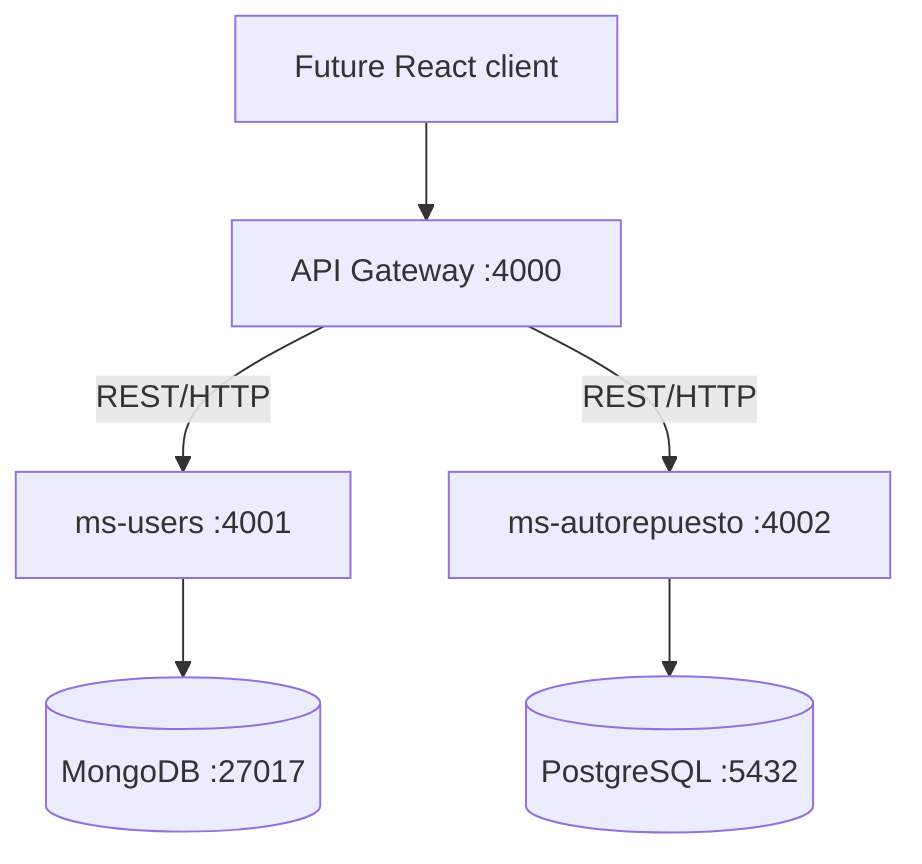

# BIELA Backend

BIELA (Base Integrada Empresarial de Logística Automotriz) is an integrated
automotive logistics platform. The backend currently implements authentication,
users, basic RBAC, and the Phase 2 automotive catalog foundation: Products,
Vehicles, and deterministic Product ↔ Vehicle Compatibility.



`ms-users` exclusively owns MongoDB authentication and RBAC data.
`ms-autorepuesto` exclusively owns PostgreSQL catalog data and Prisma
migrations. The API Gateway owns no database and has no ORM dependency.

## Implemented scope

- Phase 1: JWT authentication, users, roles, permissions, service health,
  Swagger, Postman, and CI.
- Phase 2 Products: categories, brands/manufacturers, products, active state,
  filtering, and controlled category-specific technical attributes.
- Phase 2 Vehicles: relational brands and models plus year, engine, optional
  generation/trim, active state, and deterministic filters.
- Phase 2 Compatibility: explicit Product ↔ Vehicle relation, notes, active
  state, unique pair constraint, and queries in both directions.

No Product contains stock quantity or other inventory data. See
[the Phase 2 model](docs/phase-2-data-model.md) for the actual ER diagram and
constraint rationale.

## Setup

Prerequisites are Node.js 20+, npm, Docker Engine, and Docker Compose.

```bash
cp .env.example .env
# Replace all example credentials and secrets with local values.
npm install
docker compose up -d
npm run prisma:generate
npm run prisma:deploy
npm run seed:admin
```

The administrator seed is idempotent and updates the administrator role with
the current permission set. Never commit `.env`.

Start services in separate terminals:

```bash
npm run dev:users
npm run dev:autorepuesto
npm run dev:gateway
```

## Public Phase 2 API

All public paths are exposed by the Gateway at `http://localhost:4000` and
require a bearer token unless noted otherwise.

| Domain           | Routes                                                                                                                            |
| ---------------- | --------------------------------------------------------------------------------------------------------------------------------- |
| Authentication   | `POST /api/auth/login`, `GET /api/auth/me`                                                                                        |
| Health           | `GET /health`, `GET /api/system/health`                                                                                           |
| Products         | `POST/GET /api/products`, `GET/PATCH /api/products/:id`, `PATCH /api/products/:id/activate`, `PATCH /api/products/:id/deactivate` |
| Product catalogs | `POST/GET/PATCH /api/product-categories`, `/api/product-brands`, `/api/product-attribute-definitions`                             |
| Vehicles         | `POST/GET /api/vehicles`, `GET/PATCH /api/vehicles/:id`, `PATCH /api/vehicles/:id/activate`, `PATCH /api/vehicles/:id/deactivate` |
| Vehicle catalogs | `POST/GET/PATCH /api/vehicle-brands`, `/api/vehicle-models`                                                                       |
| Compatibility    | `POST/GET /api/compatibilities`, `GET/PATCH /api/compatibilities/:id`                                                             |
| Fitment queries  | `GET /api/products/:id/vehicles`, `GET /api/vehicles/:id/products`                                                                |

List endpoints use one contract:

```json
{
  "data": [],
  "meta": { "page": 1, "limit": 20, "total": 0, "pages": 0 }
}
```

Products support search, category, brand, and active filters. Vehicles support
brand, model, year, engine, and active filters. Compatibilities support product,
vehicle, and active filters.

## Permissions

Phase 2 extends the existing stable string convention:

- `products.read`, `products.create`, `products.update`
- `vehicles.read`, `vehicles.create`, `vehicles.update`
- `compatibilities.read`, `compatibilities.manage`

`ms-autorepuesto` delegates bearer-token validation to `ms-users /auth/me` over
HTTP, then enforces these permissions. It never reads MongoDB.

## Swagger and Postman

| Component       | Swagger                      |
| --------------- | ---------------------------- |
| Gateway         | `http://localhost:4000/docs` |
| ms-users        | `http://localhost:4001/docs` |
| ms-autorepuesto | `http://localhost:4002/docs` |

Import the Phase 2 collection and environment from `docs/postman`, set only the
local administrator email/password, and run requests in order. The collection
creates a Brake Pad, Toyota Corolla 2015 1.8L vehicle, compatibility, both
directional queries, and verifies duplicate rejection. Phase 1 Postman files
remain available unchanged.

## Verification and migrations

```bash
npm run prisma:generate
npm run prisma:deploy
npm run prisma:status --workspace @biela/ms-autorepuesto
npm run lint
npm test
npm run test:e2e
npm run build
```

Create future development migrations with `npm run prisma:migrate -- --name
<name>`. Never reset a shared database. The Phase 2 migrations are additive:

- `20260816170958_phase_2_products`
- `20260816171416_phase_2_vehicles`
- `20260816171731_phase_2_compatibility`

## Manual Phase 2 verification

1. Start databases and all three services; seed the administrator.
2. Log in through `POST /api/auth/login` and use the returned bearer token.
3. Create a Product Category, Product Brand, and optional controlled attribute.
4. Create a Product.
5. Create a Vehicle Brand, Vehicle Model, and Vehicle.
6. Create a Compatibility.
7. Query `/api/products/{productId}/vehicles` and
   `/api/vehicles/{vehicleId}/products`.
8. Submit the same pair again and verify HTTP 409.

## Troubleshooting

- Check databases with `docker compose ps` and logs with `docker compose logs
mongodb postgres`.
- A Gateway 502 means an upstream is unavailable or timed out.
- A catalog-route 503 from `ms-autorepuesto` can indicate `ms-users` is
  unavailable for token validation.
- Run `npm run prisma:generate` if Prisma Client is missing and `npm run
prisma:deploy` if migration status is behind.

## Scope boundary

Inventory, physical locations, stock movements, purchasing, sales, cash
register, workshop, frontend, AI, OCR, YOLO, embeddings, semantic search,
pgvector, and `ms-intelligence` are intentionally not implemented. The next
approved work is inventory, physical locations, and deterministic search.
