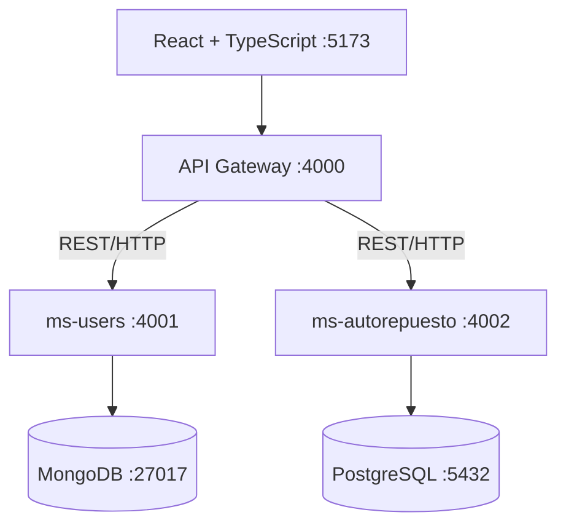

# BIELA ERP

BIELA (Base Integrada Empresarial de Logística Automotriz) is an integrated
automotive logistics platform. Its React application provides authentication,
permission-aware navigation, an ERP shell, and a real operational dashboard.
The backend implements users, RBAC, the automotive catalog, physical locations, safe inventory
movements, deterministic Product search, Suppliers, purchasing, Customers, and
the merchandise Sales/Returns lifecycle, Cash Registers, Payments, Supplier
settlement, operational receivables/payables, and Refunds.



`ms-users` exclusively owns MongoDB authentication and RBAC data.
`ms-autorepuesto` exclusively owns PostgreSQL catalog and inventory data and Prisma
migrations. The API Gateway owns no database and has no ORM dependency.

## Implemented scope

- Phase 1: JWT authentication, users, roles, permissions, service health,
  Swagger, Postman, and CI.
- Phase 2 Products: categories, brands/manufacturers, products, active state,
  filtering, and controlled category-specific technical attributes.
- Phase 2 Vehicles: relational brands and models plus year, engine, optional
  generation/trim, active state, and deterministic filters.
- Phase 2 Compatibility: explicit Product ↔ Vehicle relation, notes, active
  state, unique pair constraint, and queries in both directions.
- Phase 3 Locations: unique normalized codes and worker-readable zone, aisle,
  rack, shelf, and bin information with soft active state.
- Phase 3 Inventory: unique Product + Location balances, non-negative database
  constraints, total Product stock, and location/product queries.
- Phase 3 Movements: traceable INITIAL, IN, OUT, target-quantity ADJUSTMENT, and
  atomic TRANSFER commands with actor and before/after balances.
- Phase 3 Search: deterministic Product code/name and existing Vehicle
  compatibility search, stock/catalog filters, and stable pagination.
- Phase 5 Purchasing: Suppliers, exact-decimal Purchases and PurchaseItems,
  controlled confirmation/cancellation, partial receiving, Purchase Returns,
  database-sequenced business numbers, and commercial-to-Inventory traceability.
- Phase 6 Sales: normalized Customers, walk-in Sales, exact historical price
  snapshots, atomic Inventory `OUT`, partial Returns through Inventory `IN`, and
  concurrency-safe posting.
- Phase 7 settlement: controlled Payment Methods, Cash Registers and Sessions,
  immutable Cash Movements, partial/split Sale Payments, Return Refunds,
  reversals, exact closing snapshots, and concurrency-safe commercial limits.
- Phase 8 commercial integration: Purchase Payments, exact Purchase Return
  credits, Supplier Refunds/reversals, due dates, overdue state, Customer
  accounts, Supplier accounts, paginated receivables/payables, and a lightweight
  operational commercial summary.
- Phase 9 release readiness: full Phase 1–8 regression, fresh migration proof,
  live health/degraded-health and Swagger verification, consolidated Gateway-only
  ERP Newman coverage, frontend contract documentation, and security review.
- Phase 10 frontend foundation: Vite + React + strict TypeScript workspace,
  Gateway-only API client, session authentication, permission guards, responsive
  ERP shell, and real health/commercial dashboard.

No Product contains stock quantity or a physical-location string. See
[the Phase 3 model](docs/phase-3-data-model.md) for the actual ER diagram,
movement semantics, and concurrency strategy. See
[the backend MVP guide](docs/backend-mvp.md) for architecture, request flows,
and the complete Phase 1–4 demonstration procedure. See
[the Phase 5 purchasing model](docs/phase-5-purchasing-model.md) for commercial
lifecycle, transaction, money, and concurrency rules, and
[the Phase 6 sales model](docs/phase-6-sales-model.md) for Customer, Sale, and
Return behavior. See [the Phase 7 cash and payments model](docs/phase-7-cash-payments-model.md)
for settlement, drawer, refund-allocation, and locking rules.
See [the Phase 8 commercial integration model](docs/phase-8-commercial-integration.md)
for purchasing settlement, Supplier credits, AR/AP, due dates, and the final
cross-domain lock order. See [the stable API contract](docs/backend-api-contract.md)
and [the release-readiness guide](docs/backend-release-readiness.md) for frontend
integration and the complete operational release gate. See
[the frontend foundation guide](docs/frontend-foundation.md) for browser setup,
auth lifecycle, routes, CORS, architecture, and Phase 10 scope.

## Setup

Prerequisites are Node.js 20+, npm, Docker Engine, and Docker Compose.

```bash
cp .env.example .env
# Replace all example credentials and secrets with local values.
npm install
docker compose up -d
npm run prisma:generate
npm run prisma:deploy
npm run seed:admin
```

The administrator seed is idempotent and updates the administrator role with
the current permission set. Never commit `.env`.

Start services in separate terminals:

```bash
npm run dev:users
npm run dev:autorepuesto
npm run dev:gateway
npm run dev:frontend
```

The frontend opens at `http://localhost:5173` and calls only the Gateway. Its
public base URL is configured with `VITE_API_BASE_URL`; copy
`apps/frontend/.env.example` to an ignored `apps/frontend/.env.local` when an
override is needed. Never put secrets in `VITE_*` variables.

## Public API

All public paths are exposed by the Gateway at `http://localhost:4000` and
require a bearer token unless noted otherwise.

| Domain           | Routes                                                                                                                            |
| ---------------- | --------------------------------------------------------------------------------------------------------------------------------- |
| Authentication   | `POST /api/auth/login`, `GET /api/auth/me`                                                                                        |
| Health           | `GET /health`, `GET /api/system/health`                                                                                           |
| Products         | `POST/GET /api/products`, `GET/PATCH /api/products/:id`, `PATCH /api/products/:id/activate`, `PATCH /api/products/:id/deactivate` |
| Product catalogs | `POST/GET/PATCH /api/product-categories`, `/api/product-brands`, `/api/product-attribute-definitions`                             |
| Vehicles         | `POST/GET /api/vehicles`, `GET/PATCH /api/vehicles/:id`, `PATCH /api/vehicles/:id/activate`, `PATCH /api/vehicles/:id/deactivate` |
| Vehicle catalogs | `POST/GET/PATCH /api/vehicle-brands`, `/api/vehicle-models`                                                                       |
| Compatibility    | `POST/GET /api/compatibilities`, `GET/PATCH /api/compatibilities/:id`                                                             |
| Fitment queries  | `GET /api/products/:id/vehicles`, `GET /api/vehicles/:id/products`                                                                |
| Locations        | `POST/GET /api/locations`, `GET/PATCH /api/locations/:id`, activate/deactivate                                                    |
| Inventory        | `GET /api/inventory`, `GET /api/inventory/:id`, `GET /api/products/:id/inventory`, `GET /api/locations/:id/inventory`             |
| Movements        | `POST/GET /api/inventory/movements`                                                                                               |
| Search           | `GET /api/search/products`                                                                                                        |
| Suppliers        | `POST/GET /api/suppliers`, `GET/PATCH /api/suppliers/:id`, activate/deactivate                                                    |
| Purchases        | `POST/GET /api/purchases`, `GET/PATCH /api/purchases/:id`, `POST /api/purchases/:id/confirm`, `POST /api/purchases/:id/cancel`    |
| Receiving        | `POST/GET /api/purchases/:id/receipts`, `GET /api/purchase-receipts/:id`, `POST /api/purchase-receipts/:id/post`                  |
| Purchase returns | `POST/GET /api/purchases/:id/returns`, `GET /api/purchase-returns/:id`, `POST /api/purchase-returns/:id/post`                     |
| Customers        | `POST/GET /api/customers`, `GET/PATCH /api/customers/:id`, activate/deactivate                                                    |
| Sales            | `POST/GET /api/sales`, `GET/PATCH /api/sales/:id`, `POST /api/sales/:id/post`, `POST /api/sales/:id/cancel`                       |
| Sales returns    | `POST/GET /api/sales/:id/returns`, `GET /api/sale-returns/:id`, `POST /api/sale-returns/:id/post`                                 |
| Payment methods  | `POST/GET /api/payment-methods`, `GET/PATCH /api/payment-methods/:id`, activate/deactivate                                        |
| Cash registers   | `POST/GET /api/cash-registers`, `GET/PATCH /api/cash-registers/:id`, activate/deactivate                                          |
| Cash sessions    | Open/current, list/detail/summary, manual movement, and close routes under `/api/cash-registers` and `/api/cash-sessions`         |
| Settlement       | `POST/GET /api/sales/:id/payments`, `POST/GET /api/sale-returns/:id/refunds`, `GET /api/payments/:id`, reverse                    |
| Supplier finance | `POST/GET /api/purchases/:id/payments`, `POST/GET /api/purchase-returns/:id/refunds`                                              |
| Commercial       | `GET /api/customers/:id/account`, `GET /api/suppliers/:id/account`, `/api/commercial/receivables`, `/payables`, `/summary`        |

List endpoints use one contract:

```json
{
  "data": [],
  "meta": { "page": 1, "limit": 20, "total": 0, "pages": 0 }
}
```

Products support search, category, brand, and active filters. Vehicles support
brand, model, year, engine, and active filters. Compatibilities support product,
vehicle, and active filters. Locations support code/text/active filters.
Inventory supports Product, Location, and `inStock` filters. Movement history
supports Product, Location, type, date range, and pagination. Search supports
code/name text, Product category/brand/active/stock filters, and Vehicle ID,
brand, model, year, engine, generation, and trim criteria.

Stock is never overwritten directly. `INITIAL` creates the first balance, `IN`
adds units, `OUT` subtracts only sufficient units, `ADJUSTMENT` sets a target
quantity and requires a reason, and `TRANSFER` moves units between distinct
locations. Commands use serializable transactions with retry; decreases are
conditional atomic mutations, and transfers commit balances plus ledger record
together.

## Permissions

Phase 2 extends the existing stable string convention:

- `products.read`, `products.create`, `products.update`
- `vehicles.read`, `vehicles.create`, `vehicles.update`
- `compatibilities.read`, `compatibilities.manage`
- `locations.read`, `locations.create`, `locations.update`
- `inventory.read`, `inventory.adjust`, `inventory.transfer`
- `search.read`

`ms-autorepuesto` delegates bearer-token validation to `ms-users /auth/me` over
HTTP, then enforces these permissions. It never reads MongoDB.

Phase 5 adds:

- `suppliers.read`, `suppliers.create`, `suppliers.update`
- `purchases.read`, `purchases.create`, `purchases.update`
- `purchases.receive`, `purchases.return`

Phase 6 adds:

- `customers.read`, `customers.create`, `customers.update`
- `sales.read`, `sales.create`, `sales.update`, `sales.post`, `sales.return`

Phase 7 adds:

- `payment-methods.read`, `payment-methods.manage`
- `cash-registers.read`, `cash-registers.manage`
- `cash-sessions.read`, `cash-sessions.open`, `cash-sessions.close`
- `payments.read`, `payments.create`, `payments.reverse`
- `cash-movements.read`, `cash-movements.create`

Phase 8 adds:

- `purchases.pay`
- `commercial-receivables.read`
- `commercial-payables.read`
- `commercial-summary.read`

Existing `payments.read`, `payments.create`, and `payments.reverse` continue to
cover the shared Payment history and reversal architecture. Purchase-side
creation/refunding additionally requires `purchases.pay`.

## Swagger and Postman

| Component       | Swagger                      |
| --------------- | ---------------------------- |
| Gateway         | `http://localhost:4000/docs` |
| ms-users        | `http://localhost:4001/docs` |
| ms-autorepuesto | `http://localhost:4002/docs` |

Import the Phase 3 collection and environment from `docs/postman`, set only the
local administrator email/password, and run requests in order. The collection
creates catalog/fitment fixtures, two Locations, exercises all stock operations
and failure rollback, and verifies deterministic search. The consolidated
`BIELA-Backend-MVP` collection demonstrates the complete Gateway flow. Phase 1
and Phase 2 assets remain available for regression testing. The Phase 5
collection demonstrates Supplier → Purchase → Receipt → Inventory IN → Purchase
Return → Inventory OUT. The Phase 6 collection demonstrates Customer/walk-in
Sale → Inventory OUT → Sale Return → Inventory IN with rollback and RBAC checks.
The Phase 7 collection demonstrates partial and split settlement, physical Cash
effects, Refund eligibility, compensating reversals, manual Cash, and closing.
The Phase 8 collection demonstrates Purchase settlement and returns, Supplier
credit/refunds, purchase-side Cash effects, Customer/Supplier accounts, overdue
queries, and the operational commercial summary.
The consolidated `BIELA-Backend-ERP` collection is the Phase 9 release flow
covering the complete Phase 1–8 ERP through the Gateway.

Committed Postman environments contain no credentials. Inject local seed
credentials without printing or storing them in the collection:

```bash
npx dotenv -e .env -- sh -c '
npx newman run \
  docs/postman/BIELA-Backend-ERP.postman_collection.json \
  -e docs/postman/BIELA-Backend-ERP.postman_environment.json \
  --env-var "adminEmail=$SEED_ADMIN_EMAIL" \
  --env-var "adminPassword=$SEED_ADMIN_PASSWORD"
'
```

## Verification and migrations

```bash
npm run prisma:generate
npm run prisma:deploy
npm run prisma:status --workspace @biela/ms-autorepuesto
npm run lint
npm test
npm run test:e2e
npm run build
npm audit --omit=dev
git diff --check
```

Create future development migrations with `npm run prisma:migrate -- --name
<name>`. Never reset a shared database. The Phase 2 migrations are additive:

- `20260816170958_phase_2_products`
- `20260816171416_phase_2_vehicles`
- `20260816171731_phase_2_compatibility`

Phase 3 adds only new migrations:

- `20260816182321_phase_3_locations`
- `20260816182705_phase_3_inventory_movements`
- `20260816182800_phase_3_inventory_constraints`
- `20260816183100_phase_3_product_search_indexes`

Phase 5 adds one migration:

- `20260819110000_phase_5_purchasing`

Phase 6 adds one migration:

- `20260819143000_phase_6_sales`

Phase 7 adds one migration:

- `20260819170000_phase_7_cash_payments`

Phase 8 adds two ordered additive migrations because PostgreSQL requires new
enum values to commit before a later constraint can reference them:

- `20260819210000_phase_8_commercial_integration`
- `20260819210100_phase_8_commercial_fields`

Purchase, Receipt, Purchase Return, Sale, Sale Return, and Payment numbers use
PostgreSQL-backed `SERIAL` sequences.
Monetary values use Prisma Decimal/PostgreSQL `NUMERIC`; line subtotal is
quantity × unit cost rounded half-up to two decimals, then discount and tax are
applied as explicit amounts. Client-submitted totals are not accepted.

## Manual Phase 5 verification

1. Create an active Supplier, Product, and Location through the Gateway.
2. Create a 10-unit Purchase and verify its exact-decimal totals.
3. Confirm it and verify Inventory is unchanged.
4. Post Receipts for 6 and 4; verify PARTIALLY_RECEIVED then RECEIVED and a net
   Inventory increase of 10.
5. Attempt over-receiving and verify HTTP 409 with no stock change.
6. Post a 3-unit Purchase Return; verify a net Inventory decrease of 3.
7. Inspect Receipt `IN` and Return `OUT` movement references and Purchase detail.
8. Run the Phase 5 Newman collection using the safe credential command above.

## Manual Phase 6 verification

1. Create an active Customer and also exercise a Sale with no Customer.
2. Prepare known stock through an authorized Inventory movement.
3. Create a DRAFT Sale and verify Inventory remains unchanged.
4. POST the Sale; verify one `OUT` per line and reject duplicate posting.
5. Verify insufficient multiline stock rolls back all balances and ledger rows.
6. Create a partial Return, verify DRAFT has no effect, then POST and inspect its
   `IN` reference.
7. Reject an excessive Return and verify returned/net quantities in Sale detail.
8. Run the Phase 6 Newman collection using safe credential injection.

## Manual Phase 7 verification

1. Create active CASH and CARD methods, a Cash Register, and its single OPEN session.
2. Record partial CASH and remaining CARD Payments; verify settlement and that only CASH changes expected drawer value.
3. Post a Sale Return, issue eligible Cash/non-Cash Refunds, and reject over-refunding.
4. Reverse operations and verify immutable compensating movements without Inventory changes.
5. Exercise MANUAL_IN/MANUAL_OUT, negative-Cash protection, and actor traceability.
6. Close with counted Cash, verify snapshots, and reject later movement/duplicate close.
7. Run the Phase 7 Newman collection using safe credential injection.

## Manual Phase 8 verification

1. Confirm a Purchase with a due date and record partial CASH plus remaining
   BANK_TRANSFER settlement; only CASH reduces expected drawer value.
2. Post a Purchase Return and verify its exact cumulative line allocation
   reduces obligation and creates Supplier credit without moving money.
3. Record partial CASH and remaining non-cash Supplier Refunds, reject excess,
   and verify only CASH increases expected drawer value.
4. Reverse purchase-side operations and inspect immutable compensating Cash
   movements; verify Inventory and InventoryMovement counts are unchanged.
5. Query Customer/Supplier accounts, overdue filters, global receivables and
   payables, and `/api/commercial/summary` through the Gateway.
6. Run the Phase 8 Newman collection using safe credential injection.

## Manual Phase 3 verification

1. Log in through the Gateway and select or create an active Product.
2. Create Location A and Location B.
3. INITIAL 10 units into A; verify A=10, B=0, total=10.
4. TRANSFER 3 from A to B; verify A=7, B=3, total=10.
5. Attempt an excessive OUT and verify rejection with unchanged balances.
6. Search by exact/partial Product code, Product name, and Vehicle compatibility.
7. Query Product/Location inventory and Product movement history.

## Manual Phase 2 verification

1. Start databases and all three services; seed the administrator.
2. Log in through `POST /api/auth/login` and use the returned bearer token.
3. Create a Product Category, Product Brand, and optional controlled attribute.
4. Create a Product.
5. Create a Vehicle Brand, Vehicle Model, and Vehicle.
6. Create a Compatibility.
7. Query `/api/products/{productId}/vehicles` and
   `/api/vehicles/{vehicleId}/products`.
8. Submit the same pair again and verify HTTP 409.

## Troubleshooting

- Check databases with `docker compose ps` and logs with `docker compose logs
mongodb postgres`.
- A Gateway 502 means an upstream is unavailable or timed out.
- A catalog-route 503 from `ms-autorepuesto` can indicate `ms-users` is
  unavailable for token validation.
- `EADDRINUSE` means another process is already bound to the configured port.
  Stop the duplicate service instance or correct the local port configuration;
  this alone is an environment/process conflict, not an application defect.
- Run `npm run prisma:generate` if Prisma Client is missing and `npm run
prisma:deploy` if migration status is behind.

## Scope boundary

Cash, Payments, Supplier settlement, operational receivables/payables, and the
Phase 10 frontend foundation are implemented. Operational frontend module
workflows, general accounting, Inventory valuation/COGS, fiscal invoicing,
external financial/payment-provider integrations, workshop workflows unless
separately approved, advanced multisite operations, and AI remain intentionally
unimplemented. Do not begin a later phase without separate approval.
