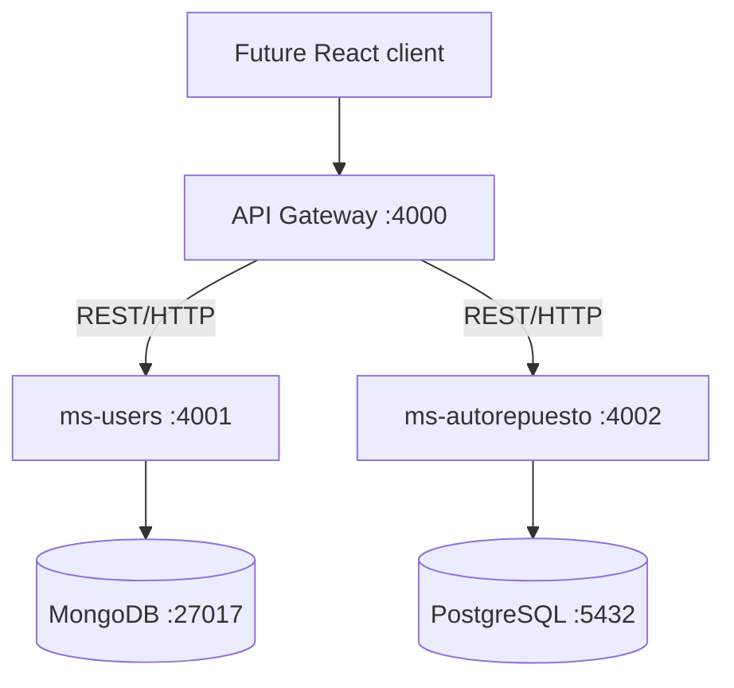

# BIELA Backend

BIELA (Base Integrada Empresarial de Logística Automotriz) is an integrated
automotive logistics platform. This repository contains the approved Backend
Phase 1 foundation: environment setup, authentication, users, basic RBAC,
service communication, documentation, and tests.



`ms-users` exclusively owns MongoDB user, role, permission, and authentication
data. `ms-autorepuesto` exclusively owns its PostgreSQL database and Prisma
migrations. The API Gateway owns no data and has no ORM/database dependency.

## Repository layout

```text
services/ms-users/          MongoDB authentication and RBAC service
services/ms-autorepuesto/   PostgreSQL/Prisma operational foundation
services/api-gateway/       Unified REST entry point
database/                   Local database operating notes
docs/postman/               Phase 1 Postman collection and environment
.github/workflows/          CI verification
```

## Prerequisites and setup

Use Node.js 20 or newer, npm, Docker Engine, and Docker Compose. Then:

```bash
cp .env.example .env
# Replace every example credential/secret in .env with local values.
npm install
docker compose up -d
docker compose ps
npm run prisma:generate
npm run prisma:deploy
npm run seed:admin
```

The administrator seed reads `SEED_ADMIN_EMAIL`, `SEED_ADMIN_PASSWORD`,
`SEED_ADMIN_FIRST_NAME`, and `SEED_ADMIN_LAST_NAME`. It creates the Phase 1
administrator role and is safe to rerun; an existing administrator is activated
and assigned the current administrator permissions.

## Development and verification

Run the services in separate terminals:

```bash
npm run dev:users
npm run dev:autorepuesto
npm run dev:gateway
```

Repository verification commands are:

```bash
npm run lint
npm test
npm run test:e2e
npm run build
```

Prisma is owned by `ms-autorepuesto`. Use `npm run prisma:migrate -- --name
<name>` to create a future development migration and `npm run prisma:deploy` to
apply committed migrations. See [database/README.md](database/README.md) before
any local reset.

## URLs and ports

| Component               | URL                          |
| ----------------------- | ---------------------------- |
| API Gateway             | `http://localhost:4000`      |
| Gateway Swagger         | `http://localhost:4000/docs` |
| ms-users Swagger        | `http://localhost:4001/docs` |
| ms-autorepuesto Swagger | `http://localhost:4002/docs` |
| MongoDB                 | `localhost:27017`            |
| PostgreSQL              | `localhost:5432`             |

Primary public routes are under `/api` on the Gateway. Swagger's Authorize
button accepts the JWT returned by `POST /api/auth/login`. Import both JSON files
from `docs/postman`, set non-committed admin/test passwords in your local Postman
environment, and run the collection in order.

## Environment contract

`.env.example` documents all required settings. Important groups are MongoDB
initialization variables, PostgreSQL initialization variables,
`MS_USERS_MONGO_URI`, JWT secret/expiry, `DATABASE_URL`, service ports, upstream
service URLs, timeout, CORS origins, and administrator seed values. Services
validate critical configuration at startup and do not provide an insecure JWT
fallback. Never commit `.env`.

## Troubleshooting

- If a database health check fails, inspect `docker compose ps` and `docker
compose logs mongodb postgres`; confirm `.env` credentials match volumes that
  were initialized with those credentials.
- If a port is occupied, change the relevant port and service URL consistently
  in `.env`.
- If Prisma Client is missing after install, run `npm run prisma:generate`.
- A Gateway 502 means the named upstream is unreachable or timed out; start the
  corresponding service and check its direct `/health` endpoint.
- Stop local databases with `docker compose down`. Data remains in named volumes.

## Scope boundary

Phase 1 intentionally does not include a frontend, AI service, catalog,
products, vehicles, compatibility, inventory, locations, purchasing, sales,
cash register, workshop, OCR, semantic search, YOLO, embeddings, or pgvector.
The next approved phase is products, vehicles, and compatibility.
