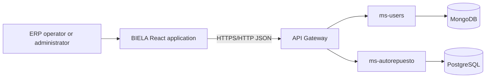
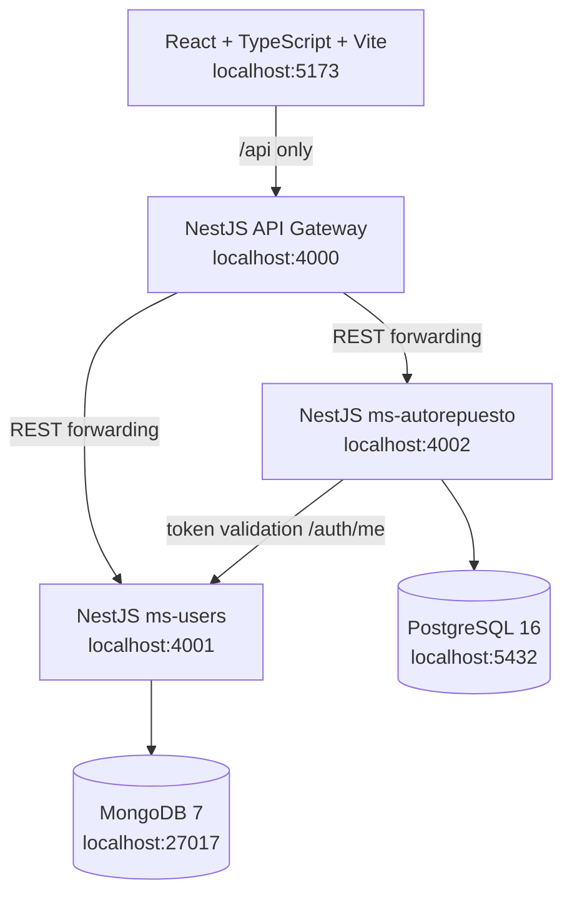
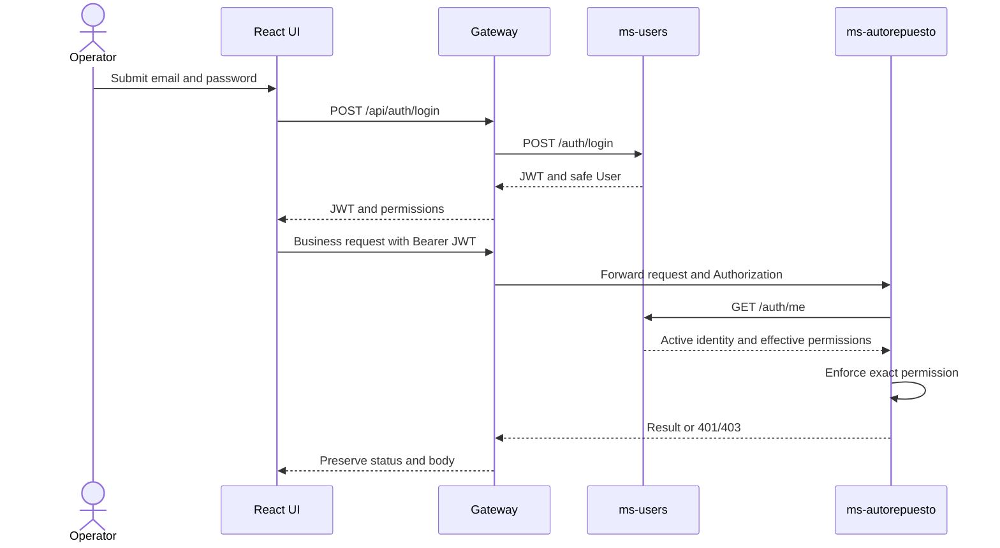
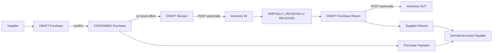
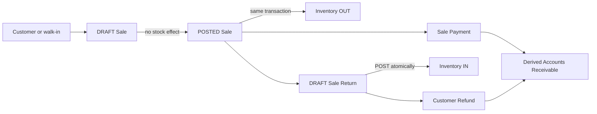
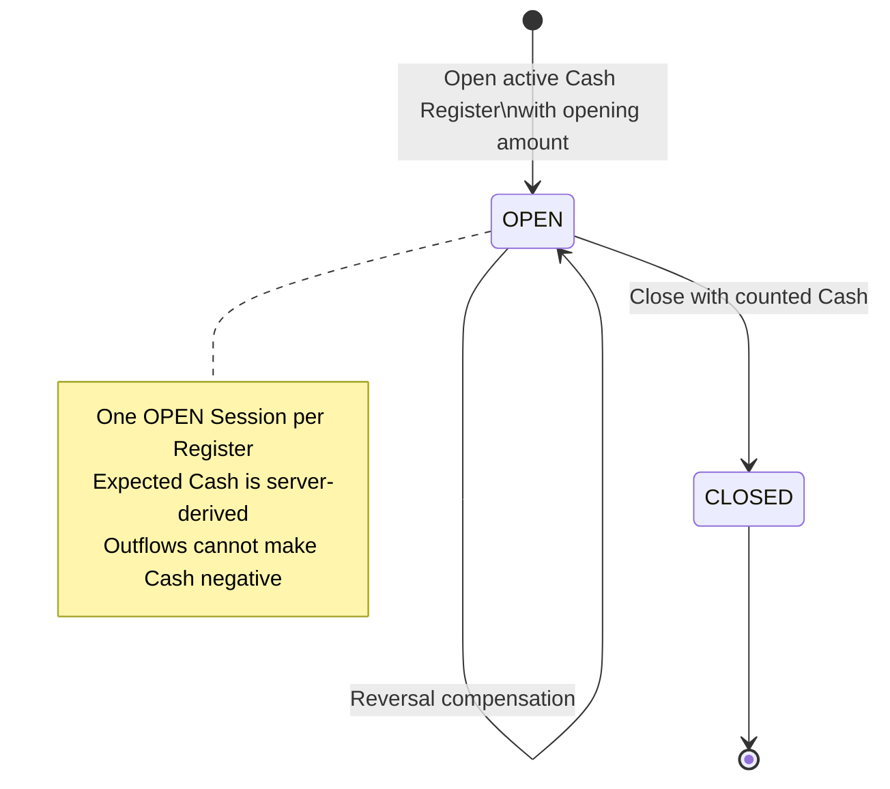
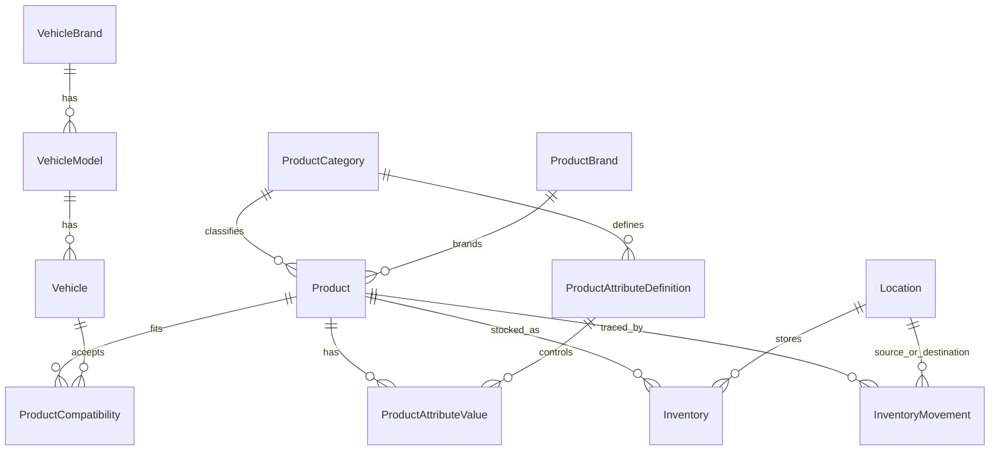

# BIELA Architecture

BIELA — Base Integrada Empresarial de Logística Automotriz — is a traditional
ERP release candidate with one browser application, a database-free API
Gateway, and two database-owning NestJS services. The architecture below is the
implemented boundary, not a future-state design.

## 1. System context

The browser calls only the Gateway. `ms-users` owns identity and RBAC in
MongoDB. `ms-autorepuesto` owns operational ERP data and the complete Prisma
migration history in PostgreSQL. The Gateway owns no database and performs no
stock, money, Cash, settlement, or lifecycle calculation.

## 2. Local runtime and ports

Only port 4000 is a public business API for the browser. Ports 4001 and 4002
are service boundaries, while 27017 and 5432 are database boundaries.

## 3. Authentication and RBAC

Frontend guards and navigation are usability controls only. Backend guards are
authoritative. The browser stores only the access token in session storage;
passwords are write-only and `passwordHash` is excluded from Mongo queries and
JSON output.

## 4. Purchasing and Inventory flow

Purchase confirmation never increases stock. Receipt POST and Purchase Return
POST are the only purchasing stock effects. Payments and Refunds affect
settlement and physical Cash when their Payment Method is CASH; they do not
change Inventory.

## 5. Sales and Inventory flow

A walk-in Sale deliberately has no Customer. Sale POST and Sale Return POST are
the stock-changing commands. Historical item prices are immutable snapshots;
the frontend never recomputes authoritative totals or outstanding balances.

## 6. Cash lifecycle and immutable ledger

Every physical-Cash effect appends a typed `CashMovement`. Reversal retains the
original Payment and appends its compensating movement. The ledger is
server-paginated and ordered newest-first; session summary clients request
`includeMovements=false` when they do not need ledger rows.

## 7. Catalog, fitment, and Inventory relationships

Product is catalog data only. Inventory is unique per Product + Location, is
never negative, and changes only through the Inventory Movement engine.
Compatibility is an explicit unique Product + Vehicle relation; deterministic
search uses catalog text and that existing relation, not AI or semantic search.

## Cross-service ownership

| Component | Owns | Must not own |
| --- | --- | --- |
| React application | forms, routing, accessible presentation, query cache | business totals, stock, Cash authority, direct service/database access |
| API Gateway | public `/api` facade, transport forwarding, aggregate health | database clients, repositories, business calculations |
| `ms-users` | users, roles, permissions, password hashes, JWT, MongoDB | PostgreSQL operational data |
| `ms-autorepuesto` | catalog, Inventory, commercial documents, settlement, Cash, PostgreSQL/Prisma | MongoDB identity storage |

## Consistency and concurrency

PostgreSQL commands use serializable transactions, bounded retry, conditional
stock decrements, row locks, unique business effects, and database constraints.
The lock order for financial work is document, optional Return, optional
Payment, then Cash Session. MongoDB role permissions are validated against the
controlled 54-code catalog. These protections remain backend-authoritative.

## Deferred architecture

General accounting, fiscal invoicing, Inventory valuation/COGS accounting,
external payment-provider integration, offline operation, advanced workshop or
multisite expansion, and AI are not part of this release candidate.
