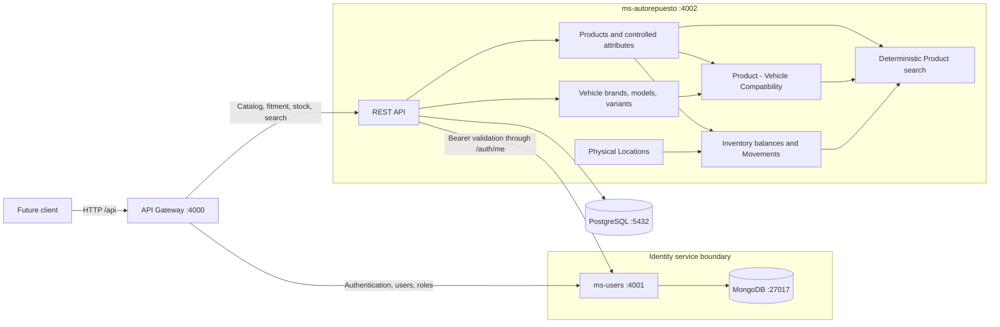

# BIELA Backend MVP

This document describes the implemented and verified backend scope after Phase
4 stabilization. It does not describe deployed infrastructure or approve a new
product phase.

## Architecture and ownership



`ms-users` exclusively owns MongoDB and identity/RBAC data.
`ms-autorepuesto` exclusively owns PostgreSQL, Prisma migrations, the automotive
catalog, compatibility, locations, inventory, movements, and search. The API
Gateway owns no database and contains forwarding logic rather than duplicated
business rules. Inter-service communication uses HTTP APIs.

## Implemented scope

- Identity: JWT login, current-user lookup, users, roles, permissions, and an
  idempotent administrator seed.
- Catalog: Product Categories, Product Brands, controlled typed Product
  attributes, and Products with normalized unique codes.
- Vehicles: Vehicle Brands, Vehicle Models, and concrete year/engine variants.
- Fitment: explicit, unique Product-to-Vehicle Compatibility records and
  queries in both directions.
- Operations: physical Locations; unique Product + Location inventory balances;
  INITIAL, IN, OUT, target-balance ADJUSTMENT, and TRANSFER ledger entries.
- Search: deterministic Product code/name search, catalog filters, explicit
  Vehicle compatibility filters, active state, stock availability, ranking, and
  stable pagination.

Frontend, purchasing, sales, invoicing, workshop, accounting, multisite,
notifications, AI, semantic search, and external search systems are not part of
this MVP.

## Main domain relationships

Product catalog data is separate from stock. A Product belongs to a Product
Category and may reference a Product Brand and typed values governed by the
Category's attribute definitions. A Vehicle belongs to a Vehicle Model, which
belongs to a Vehicle Brand. `ProductCompatibility` explicitly joins a Product
and a Vehicle and enforces one record per pair.

Inventory is one non-negative balance per Product + Location. Every supported
balance mutation also creates an `InventoryMovement`; there is no direct
quantity-overwrite endpoint. Product total stock is derived by summing its
location balances.

## Request flows

### Authentication

1. A client sends credentials to `POST /api/auth/login` on the Gateway.
2. The Gateway forwards the body to `ms-users`.
3. `ms-users` verifies the Argon2id password hash and signs a short-lived JWT
   with the environment-provided secret.
4. For automotive requests, the Gateway forwards the bearer token to
   `ms-autorepuesto`.
5. `ms-autorepuesto` validates that token through the `ms-users /auth/me` API,
   then enforces the required permission locally. It never reads MongoDB.

### Inventory

1. The caller sends a typed movement command through the Gateway.
2. `ms-autorepuesto` validates entity state, movement shape, quantity, reason,
   and permission.
3. INITIAL, IN, OUT, ADJUSTMENT, or TRANSFER executes in a serializable Prisma
   transaction. Decrements are conditional so stock cannot become negative.
4. TRANSFER changes both location balances and writes its single ledger entry in
   the same transaction. Serializable conflicts have bounded retries.
5. Read endpoints return balance rows, derived Product totals, or traceable
   movement history.

### Deterministic search

The Gateway forwards query parameters to PostgreSQL-backed search in
`ms-autorepuesto`. Search combines normalized Product code/name conditions,
catalog and availability filters, and the existing explicit Compatibility
relation. Exact code ranks before partial matches, then stable secondary fields
and ID order pagination deterministically. `pg_trgm` and GIN indexes are enabled
by additive migration; no semantic or external search is used.

## Local startup

Prerequisites are Node.js 20+, npm, Docker Engine, and Docker Compose.

```bash
cp .env.example .env
# Replace example secrets with local-only values.
npm ci
docker compose up -d
npm run prisma:generate
npm run prisma:deploy
npm run seed:admin
```

Start each service in its own terminal:

```bash
npm run dev:users
npm run dev:autorepuesto
npm run dev:gateway
```

Swagger is available at `http://localhost:4000/docs`,
`http://localhost:4001/docs`, and `http://localhost:4002/docs`.

## MVP demonstration

Use the consolidated collection to exercise the real Gateway without placing
credentials in tracked JSON:

```bash
npx dotenv -e .env -- sh -c '
npx newman run \
  docs/postman/BIELA-Backend-MVP.postman_collection.json \
  -e docs/postman/BIELA-Backend-MVP.postman_environment.json \
  --env-var "adminEmail=$SEED_ADMIN_EMAIL" \
  --env-var "adminPassword=$SEED_ADMIN_PASSWORD"
'
```

The collection uses generated fixture codes and demonstrates system health,
login/current user, Product and Vehicle setup, explicit fitment, two Locations,
INITIAL/IN/OUT/TRANSFER, balance and ledger queries, deterministic searches,
insufficient-stock rollback, and an authenticated `403` authorization case.
It intentionally leaves demonstration records in the development database; do
not run it against a production or shared non-test database.

## Verification

```bash
npm run prisma:generate
npm run prisma:deploy
npm run prisma:status --workspace @biela/ms-autorepuesto
npm run lint
npm test
npm run test:e2e
npm run build
npm audit --omit=dev
git diff --check
```

CI runs dependency installation, Prisma generation/deployment, lint, unit and
e2e tests with MongoDB/PostgreSQL service containers, and the build. If startup
reports `EADDRINUSE`, first check for an already-running duplicate process on the
configured port; that condition is not by itself an application defect.
