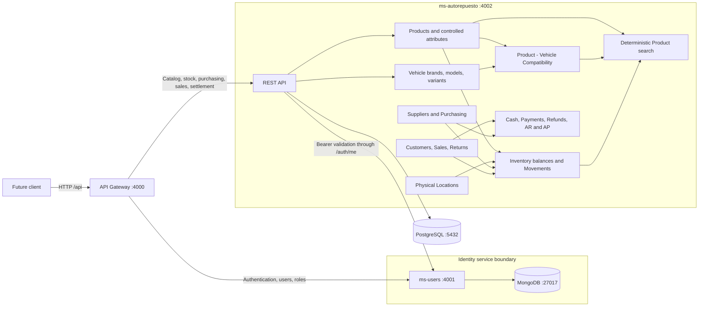

# BIELA Backend MVP

This document describes the implemented business backend scope through Phase 8
and the Phase 9 release-readiness verification. It does not describe deployed
infrastructure or approve a new product phase.

## Architecture and ownership



`ms-users` exclusively owns MongoDB and identity/RBAC data.
`ms-autorepuesto` exclusively owns PostgreSQL, Prisma migrations, the automotive
catalog, compatibility, locations, inventory, movements, and search. The API
Gateway owns no database and contains forwarding logic rather than duplicated
business rules. Inter-service communication uses HTTP APIs.

## Implemented scope

- Identity: JWT login, current-user lookup, users, roles, permissions, and an
  idempotent administrator seed.
- Catalog: Product Categories, Product Brands, controlled typed Product
  attributes, and Products with normalized unique codes.
- Vehicles: Vehicle Brands, Vehicle Models, and concrete year/engine variants.
- Fitment: explicit, unique Product-to-Vehicle Compatibility records and
  queries in both directions.
- Operations: physical Locations; unique Product + Location inventory balances;
  INITIAL, IN, OUT, target-balance ADJUSTMENT, and TRANSFER ledger entries.
- Search: deterministic Product code/name search, catalog filters, explicit
  Vehicle compatibility filters, active state, stock availability, ranking, and
  stable pagination.
- Purchasing: Suppliers, exact-money Purchases, partial Receipts, Purchase
  Returns, and controlled Inventory references.
- Sales: Customers and walk-in Sales, exact historical price snapshots, atomic
  Inventory OUT posting, partial Returns through Inventory IN, and concurrency
  protection against overselling and over-return.
- Settlement: controlled Payment Methods, one OPEN Cash Session per register,
  partial/split Payments, Refund eligibility, reversals, manual drawer
  movements, and exact Cash close snapshots.
- Commercial integration: Purchase Payments and Supplier Refunds on the same
  Payment/Cash ledgers, exact Return credits, optional due dates, overdue state,
  Customer/Supplier accounts, and paginated operational AR/AP queries.

Frontend, fiscal invoicing, workshop, general accounting, inventory
valuation/COGS, multisite, notifications, AI, semantic search, and external
provider integrations are not part of this MVP.

## Main domain relationships

Product catalog data is separate from stock. A Product belongs to a Product
Category and may reference a Product Brand and typed values governed by the
Category's attribute definitions. A Vehicle belongs to a Vehicle Model, which
belongs to a Vehicle Brand. `ProductCompatibility` explicitly joins a Product
and a Vehicle and enforces one record per pair.

Inventory is one non-negative balance per Product + Location. Every supported
balance mutation also creates an `InventoryMovement`; there is no direct
quantity-overwrite endpoint. Product total stock is derived by summing its
location balances.

## Request flows

### Authentication

1. A client sends credentials to `POST /api/auth/login` on the Gateway.
2. The Gateway forwards the body to `ms-users`.
3. `ms-users` verifies the Argon2id password hash and signs a short-lived JWT
   with the environment-provided secret.
4. For automotive requests, the Gateway forwards the bearer token to
   `ms-autorepuesto`.
5. `ms-autorepuesto` validates that token through the `ms-users /auth/me` API,
   then enforces the required permission locally. It never reads MongoDB.

### Inventory

1. The caller sends a typed movement command through the Gateway.
2. `ms-autorepuesto` validates entity state, movement shape, quantity, reason,
   and permission.
3. INITIAL, IN, OUT, ADJUSTMENT, or TRANSFER executes in a serializable Prisma
   transaction. Decrements are conditional so stock cannot become negative.
4. TRANSFER changes both location balances and writes its single ledger entry in
   the same transaction. Serializable conflicts have bounded retries.
5. Read endpoints return balance rows, derived Product totals, or traceable
   movement history.

### Deterministic search

The Gateway forwards query parameters to PostgreSQL-backed search in
`ms-autorepuesto`. Search combines normalized Product code/name conditions,
catalog and availability filters, and the existing explicit Compatibility
relation. Exact code ranks before partial matches, then stable secondary fields
and ID order pagination deterministically. `pg_trgm` and GIN indexes are enabled
by additive migration; no semantic or external search is used.

### Payments, Refunds, and Cash

1. Every Payment/Refund locks its POSTED Sale and recalculates limits with
   Prisma Decimal inside a serializable transaction.
2. CASH operations additionally lock an OPEN session whose register is active,
   then atomically create the financial row and its physical CashMovement.
3. Non-cash operations create no physical drawer movement and call no provider.
4. Refund capacity is the lesser of the Return value remaining and active paid
   money less active Refunds. Return values allocate immutable SaleItem line
   totals proportionally with cumulative half-up rounding.
5. Reversals preserve the Payment and append compensating Cash history where
   applicable. Phase 7 operations never call the Inventory mutation engine.
6. Closing locks the session, derives expected Cash from the ledger, stores
   expected/count/difference, and prevents any later movement from committing.

### Purchase settlement and operational AR/AP

1. Confirmed or received Purchases may receive partial/split Payments. Posted
   Purchase Returns reduce net obligation using immutable PurchaseItem values.
2. A Supplier Refund is separately registered only when both Return value and
   Supplier credit remain; CASH enters the shared Cash ledger.
3. CASH Purchase Payments leave the drawer. Their reversals enter it. CASH
   Supplier Refund reversals leave it. Every outflow checks expected Cash.
4. Optional `paymentDueDate` does not change Sale/Purchase lifecycle or
   Inventory. Overdue is derived when a due date precedes the current
   Tegucigalpa business date and an exact amount remains outstanding.
5. Customer/Supplier accounts and global receivable/payable lists use grouped
   PostgreSQL queries over documents and active Payment rows. No mutable
   balance column or accounting journal is maintained.

## Local startup

Prerequisites are Node.js 20+, npm, Docker Engine, and Docker Compose.

```bash
cp .env.example .env
# Replace example secrets with local-only values.
npm ci
docker compose up -d
npm run prisma:generate
npm run prisma:deploy
npm run seed:admin
```

Start each service in its own terminal:

```bash
npm run dev:users
npm run dev:autorepuesto
npm run dev:gateway
```

Swagger is available at `http://localhost:4000/docs`,
`http://localhost:4001/docs`, and `http://localhost:4002/docs`.

## MVP demonstration

Use the consolidated ERP collection to exercise the real Gateway without
placing credentials in tracked JSON:

```bash
npx dotenv -e .env -- sh -c '
npx newman run \
  docs/postman/BIELA-Backend-ERP.postman_collection.json \
  -e docs/postman/BIELA-Backend-ERP.postman_environment.json \
  --env-var "adminEmail=$SEED_ADMIN_EMAIL" \
  --env-var "adminPassword=$SEED_ADMIN_PASSWORD"
'
```

The collection uses generated fixture codes and demonstrates system health,
login/current user, Product and Vehicle setup, explicit fitment, Location and
Inventory, deterministic search, Purchase/Receipt/Payment/Return/Refund, Sale
POST/Payment/Return/Refund, Cash effects and closing, Customer/Supplier accounts,
receivables/payables, Commercial Summary, and authenticated 401/403 behavior.
It intentionally leaves demonstration records in the development database; do
not run it against a production or shared non-test database.

The stable frontend-facing contract is summarized in
[`backend-api-contract.md`](backend-api-contract.md). Operational setup,
verification evidence, and troubleshooting are in
[`backend-release-readiness.md`](backend-release-readiness.md).

## Verification

```bash
npm run prisma:generate
npm run prisma:deploy
npm run prisma:status --workspace @biela/ms-autorepuesto
npm run lint
npm test
npm run test:e2e
npm run build
npm audit --omit=dev
git diff --check
```

CI runs dependency installation, Prisma generation/deployment, lint, unit and
e2e tests with MongoDB/PostgreSQL service containers, and the build. If startup
reports `EADDRINUSE`, first check for an already-running duplicate process on the
configured port; that condition is not by itself an application defect.
