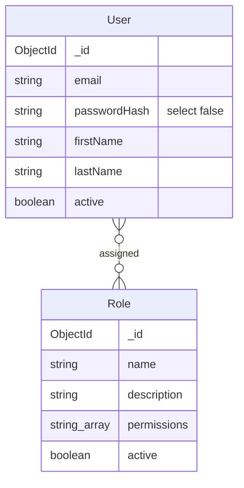
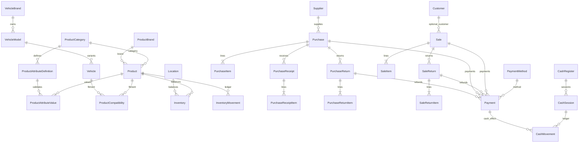

# BIELA Data Model and Ownership

The databases are separate by service ownership. There is no cross-database
join and no service reads another service's database.

## MongoDB: identity and RBAC

`ms-users` owns both collections. Email and Role name are unique. The password
hash is never selected by ordinary reads and is removed again by JSON
serialization. Permissions are exact strings from the 54-code catalog.

## PostgreSQL: operational ERP

The authoritative schema is
`services/ms-autorepuesto/prisma/schema.prisma`. Its 29 models are:

- Catalog and fitment: ProductCategory, ProductBrand, Product,
  ProductAttributeDefinition, ProductAttributeValue, VehicleBrand,
  VehicleModel, Vehicle, ProductCompatibility.
- Warehouse: Location, Inventory, InventoryMovement.
- Purchasing: Supplier, Purchase, PurchaseItem, PurchaseReceipt,
  PurchaseReceiptItem, PurchaseReturn, PurchaseReturnItem.
- Sales: Customer, Sale, SaleItem, SaleReturn, SaleReturnItem.
- Settlement and Cash: PaymentMethod, CashRegister, CashSession, Payment,
  CashMovement.

## Invariants

- Product has no stock field. Inventory is unique by Product + Location.
- Inventory quantities and commercial quantities cannot be negative; movement
  commands are the only balance mutation path.
- ProductCompatibility is unique by Product + Vehicle.
- Posted commercial line effects are unique and immutable.
- Money uses PostgreSQL `NUMERIC` through Prisma Decimal.
- Purchase, Receipt, Return, Sale, Sale Return, and Payment numbers are
  database-sequenced.
- Only one OPEN Cash Session may exist per Cash Register.
- CashMovement is immutable; Payment reversal is a retained status change plus
  a compensating Cash Movement when applicable.
- AR/AP and expected Cash are derived, not mutable stored account balances.

## Migration history

The schema is reproduced by 13 ordered migrations: one Phase 1 baseline, three
Phase 2 catalog migrations, four Phase 3 warehouse/search migrations, one each
for Phases 5, 6, and 7, and two ordered Phase 8 commercial migrations. Phase 13
adds no schema or migration. Historical SQL is immutable.
