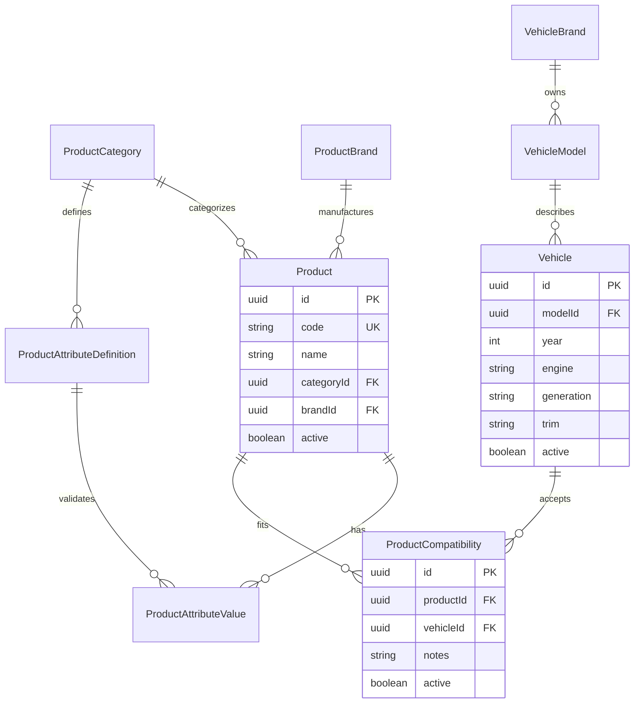

# BIELA Phase 2 data model

Phase 2 is owned exclusively by `ms-autorepuesto` and PostgreSQL. The API
Gateway contains no Prisma dependency and `ms-users` retains exclusive ownership
of authentication and role data.

Product technical attributes use controlled, category-scoped definitions with a
declared `STRING`, `NUMBER`, or `BOOLEAN` value type. Values are relational and
unique per Product/definition; they are not arbitrary JSON. Product quantities
and all inventory concepts remain outside the Product model.

Vehicle fitment is deterministic through Brand → Model → Vehicle, with year,
engine, and optional generation/trim. PostgreSQL enforces the supported year
range of 1886–2100.

`ProductCompatibility` is an explicit relation with restricted foreign keys,
indexes on both directions, active-state management, and a database-level
unique `(productId, vehicleId)` constraint.
