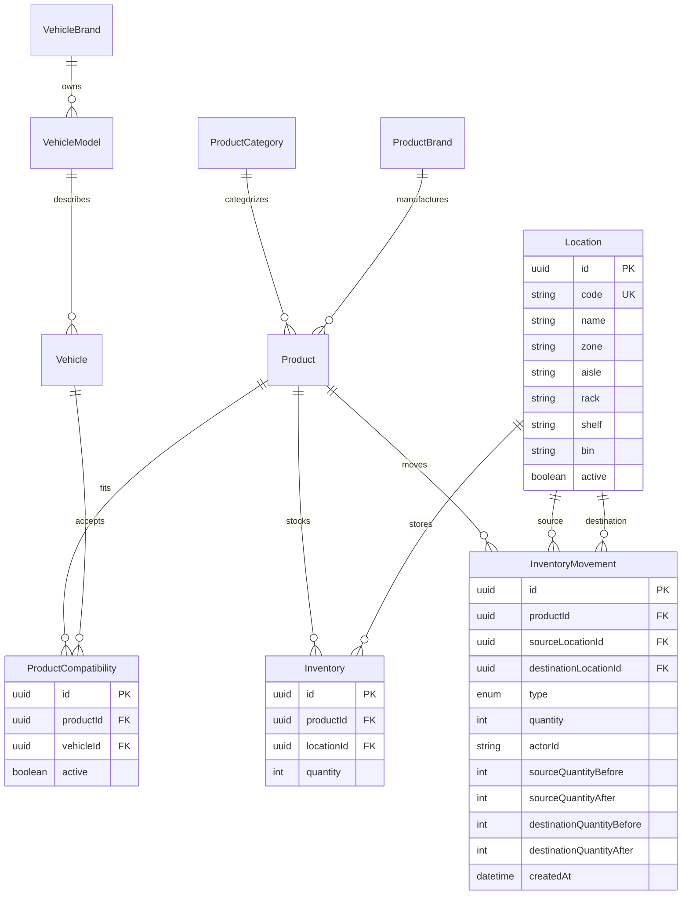

# BIELA Phase 3 data model

Phase 3 remains exclusively owned by `ms-autorepuesto` and PostgreSQL. The API
Gateway forwards HTTP requests and owns no inventory state, ORM, or database
connection. `actorId` is copied from the authenticated request and is not a
cross-database foreign key.

PostgreSQL enforces unique Location codes, unique `(productId, locationId)`
balances, non-negative quantities and audit balances, and valid movement source
and destination combinations. Existing Product and Compatibility data is
reused without duplication.

## Movement semantics

- `INITIAL`: creates the first Product + Location balance. A second INITIAL for
  the pair is rejected.
- `IN`: adds a positive quantity to one destination.
- `OUT`: atomically subtracts a positive quantity only when sufficient stock
  exists.
- `ADJUSTMENT`: sets an initialized destination balance to the supplied
  non-negative target quantity; a reason is mandatory.
- `TRANSFER`: atomically subtracts from one location, adds to another, and writes
  one ledger record. Source and destination must differ.

All commands run in serializable Prisma transactions with bounded retry for
PostgreSQL write conflicts. OUT and TRANSFER additionally use conditional
atomic decrements (`quantity >= requested`) so concurrent commands cannot make
stock negative. Before/after balances and actor identifier are stored with each
movement.

## Deterministic search

`GET /search/products` searches normalized Product code and case-insensitive
Product name, or traverses the existing active ProductCompatibility → Vehicle
relation. Exact code matches rank first. Remaining results use stable Product
code and ID ordering. Availability and total stock are derived from Inventory;
no quantity is stored on Product.
