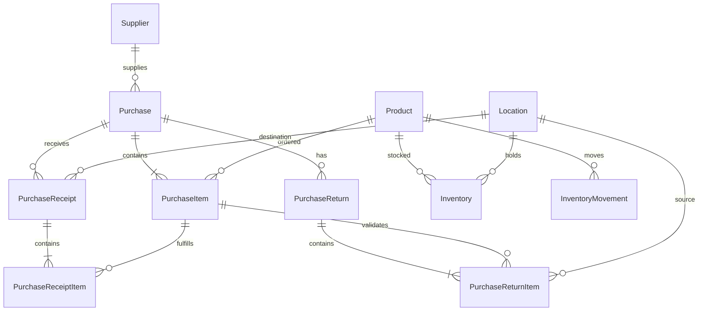
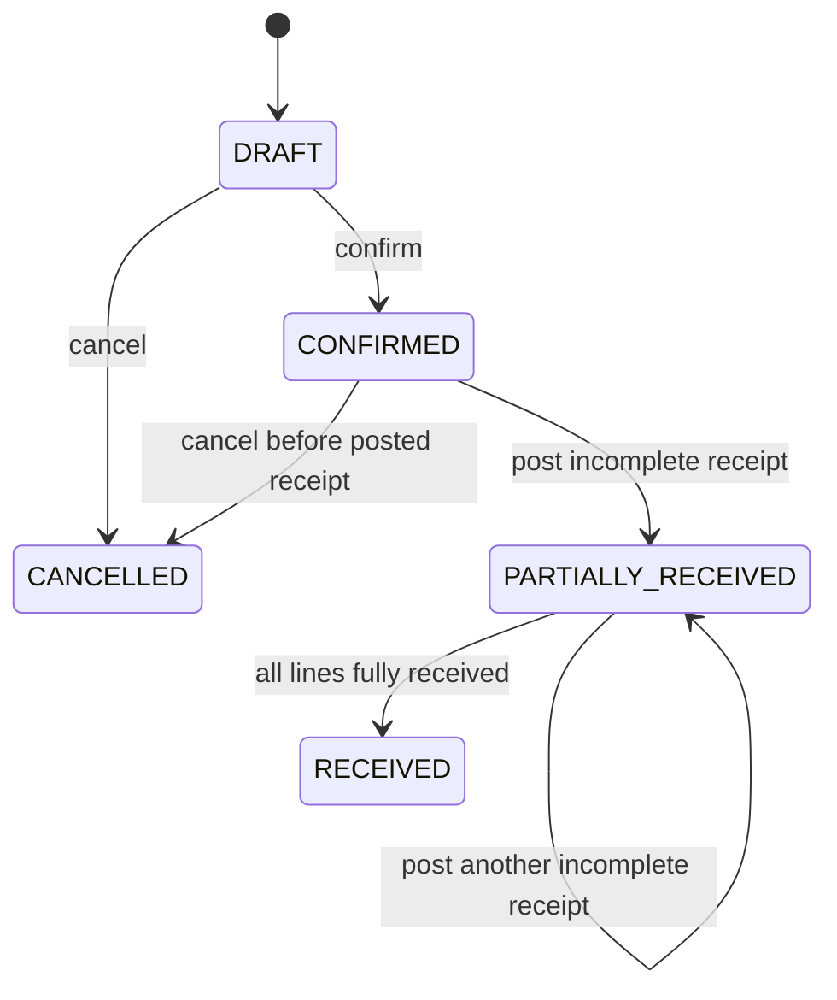
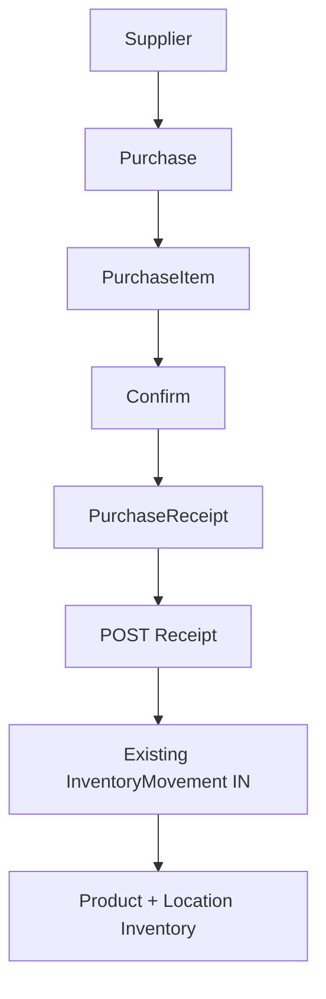
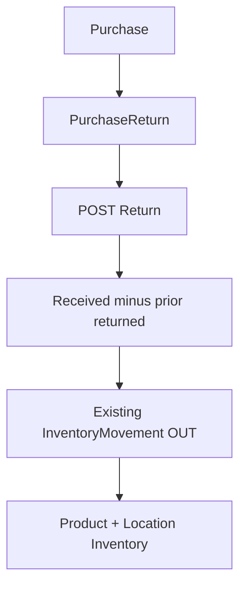

# BIELA Phase 5 Purchasing Model

Phase 5 implements only the purchasing side of the commercial backend. It keeps
`ms-autorepuesto` as PostgreSQL owner, leaves `ms-users` as MongoDB owner, and
keeps the API Gateway database-free.

## Domain model



`Supplier.code` is normalized uppercase and unique. Deactivation is soft: it
prevents new Purchases while retaining all historical documents.

Purchase, PurchaseReceipt, and PurchaseReturn use integer business numbers from
independent PostgreSQL sequences. UUIDs remain the technical primary keys.
Sequence allocation is atomic and concurrency-safe; gaps after rolled-back
transactions are expected and numbers are never reused.

## Purchase and exact money

A Purchase begins as `DRAFT` and contains at least one PurchaseItem. One Product
may appear only once per Purchase. Quantities are positive integers, consistent
with the existing Inventory model.

Money is persisted as PostgreSQL `NUMERIC`: unit cost uses four decimal places;
totals use two. Calculations use `Prisma.Decimal`:

```text
lineSubtotal = roundHalfUp(orderedQuantity × unitCost, 2)
lineTotal    = lineSubtotal - discountAmount + taxAmount
subtotal     = sum(lineSubtotal)
total        = subtotal - discountTotal + taxTotal
```

Discount and tax are explicit non-negative amounts. Discount cannot exceed its
line subtotal. The service calculates all line/header totals; clients cannot
submit trusted totals. Database checks enforce positive quantities, non-negative
money, discount bounds, and header/line formulas.

Purchase lifecycle:



Only DRAFT Purchases are editable. Confirmation revalidates the active Supplier,
active Products, and exact totals, records the actor/time, and does not change
Inventory. A Purchase with posted receiving cannot be cancelled.

Purchase detail returns Supplier and Product summaries, historical unit costs,
ordered/received/returned quantities, remaining receivable quantity, totals,
and Receipt/Return summaries.

## Partial receiving and Inventory IN



A Receipt draft references PurchaseItems and one active destination Location.
Posting locks the Purchase row, revalidates ownership and cumulative posted
receipts, and rejects any quantity above the ordered amount. Each ReceiptItem
calls the transaction-aware existing Inventory movement engine with `IN`.

The Receipt status, actor/time, Purchase status, Inventory balances, and all
ledger rows commit in one serializable transaction. `RECEIVED` means every line
is exactly fulfilled; otherwise any posted quantity produces
`PARTIALLY_RECEIVED`.

## Purchase Returns and Inventory OUT



Return eligibility per PurchaseItem is total posted received minus total posted
returned. Posting also requires sufficient current physical stock at the chosen
active source Location. Each ReturnItem calls the same Inventory engine with
`OUT`, preserving its conditional decrement and negative-stock protection.
Return header/items and all Inventory effects commit or roll back together.

## Traceability, transactions, and concurrency

Phase 5 extends InventoryMovement with controlled `referenceType`, `referenceId`,
and `referenceItemId` fields. Only `PURCHASE_RECEIPT` with `IN` and
`PURCHASE_RETURN` with `OUT` are accepted by database checks. A unique
reference-type/item constraint prevents duplicate line effects.

Receipt and Return posting use serializable Prisma transactions with bounded
three-attempt retry. PostgreSQL `FOR UPDATE` locks serialize all posting for the
same Purchase. Both Prisma `P2034` and raw-query PostgreSQL serialization/deadlock
codes are recognized. Consequently concurrent drafts cannot over-receive,
over-return, double-post, or create negative stock.

Posted Receipt and Return fields affecting stock have no update endpoint and are
immutable. Draft creation never changes Inventory.

## Permissions and Gateway routes

Permissions:

- `suppliers.read`, `suppliers.create`, `suppliers.update`
- `purchases.read`, `purchases.create`, `purchases.update`
- `purchases.receive`, `purchases.return`

The idempotent ADMIN seed includes every permission. Actor traceability stores
only the propagated authenticated user ID; `ms-autorepuesto` never accesses
MongoDB.

Public Gateway routes are under `/api`: Supplier CRUD/activation, Purchase
create/list/detail/update/confirm/cancel, nested Receipt/Return create/list, and
Receipt/Return detail/post. The Gateway only forwards bearer headers, bodies,
queries, and upstream status codes.

## Postman and verification

Run the complete live flow without storing credentials:

```bash
npx dotenv -e .env -- sh -c '
npx newman run \
  docs/postman/BIELA-Phase-5.postman_collection.json \
  -e docs/postman/BIELA-Phase-5.postman_environment.json \
  --env-var "adminEmail=$SEED_ADMIN_EMAIL" \
  --env-var "adminPassword=$SEED_ADMIN_PASSWORD"
'
```

The collection creates generated development fixtures, confirms without stock
change, receives 6 + 4, rejects over-receiving, returns 3, verifies IN/OUT
references and derived history, and checks `401`/`403`. It leaves demonstration
records behind; do not run it against production or a shared non-test database.

Verification commands:

```bash
npm run prisma:generate
npm run prisma:deploy
npm run prisma:status --workspace @biela/ms-autorepuesto
npm run lint
npm test
npm run test:e2e
npm run build
npm audit --omit=dev
git diff --check
```

## Known limitations

Sales and Customers are intentionally deferred to Phase 6. Cash is intentionally
deferred to Phase 7. Payments, accounts payable, accounting, valuation/COGS,
frontend, multisite behavior, forecasting, and AI are not implemented.
