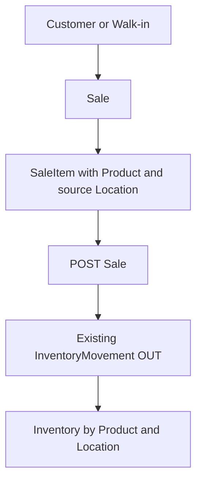
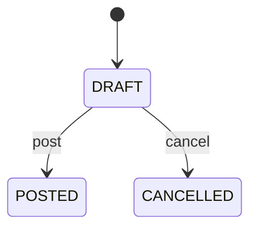
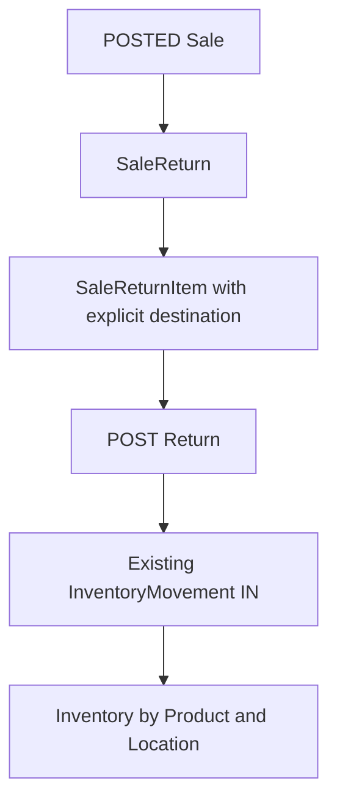

# BIELA Phase 6 Sales Model

Phase 6 implements merchandise Sales and Returns. `ms-autorepuesto` owns the
PostgreSQL data and rules, `ms-users` remains the identity/RBAC owner, and the
database-free Gateway only forwards HTTP requests. Cash, Payments, receivables,
refund settlement, fiscal invoicing, frontend, and AI are not part of this phase.

## Customers and walk-in Sales

`Customer` stores a normalized uppercase unique code, required name, optional
business/tax/contact details, and an active flag. Deactivation is non-destructive:
an inactive Customer cannot be assigned to a new or edited DRAFT Sale, while
historical Sales remain readable. A Sale with `customerId = null` is a valid
walk-in Sale; no synthetic Customer is created.

## Product price and historical money

`Product.defaultSalePrice` is an optional non-negative `NUMERIC(18,4)` current
suggestion. Existing Products remain valid after migration. A Sale line may
provide its own price; otherwise creation uses the Product default and rejects
the request if neither exists.

`SaleItem.unitPrice` is the immutable historical snapshot. Updating a Product
price never reprices an existing Sale. Calculations use `Prisma.Decimal`:

```text
lineSubtotal = roundHalfUp(quantity × unitPrice, 2)
lineTotal    = lineSubtotal - discountAmount + taxAmount
subtotal     = sum(lineSubtotal)
total        = subtotal - discountTotal + taxTotal
```

The server calculates every total. PostgreSQL checks enforce positive integer
quantities, non-negative money, discount bounds, and exact header/line formulas.

## Sale lifecycle and Inventory OUT





A DRAFT is editable and has no stock effect. Posting revalidates the optional
Customer, Products, source Locations, prices, and totals. Items are processed in
stable `productId + locationId` order. Each line calls the existing
transaction-aware Inventory movement engine with `OUT`; Sales code never writes
an Inventory balance directly.

The Sale status, actor/time, balances, and ledger rows commit in one serializable
transaction. Insufficient stock on any line rolls back all lines. A POSTED Sale
cannot be edited or cancelled; physical reversals use a Sale Return.

Sale numbers use the PostgreSQL sequence behind `SERIAL`. UUID remains the
technical key. Sequence allocation is atomic and safe under concurrency; gaps
after rollback are expected.

## Sale Returns and Inventory IN



A Return can reference only SaleItems belonging to its POSTED Sale. The Product
comes from the immutable SaleItem; each returned line chooses an active
destination Location. DRAFT Returns do not affect stock.

Eligibility is derived relationally:

```text
returnable = sold quantity - sum(POSTED returned quantity)
```

Posting locks the original Sale, locks the Return, recalculates eligibility,
then calls the existing Inventory engine with `IN`. Status, actor/time, balances,
and ledger effects commit together. POSTED Returns have no mutation endpoint.
No cash refund, Payment, or receivable adjustment is created.

## Traceability and concurrency

`InventoryMovementReferenceType` adds `SALE` and `SALE_RETURN` without changing
`PURCHASE_RECEIPT` or `PURCHASE_RETURN`. Database checks require Sale references
to use `OUT` and Return references to use `IN`. The existing unique
`(referenceType, referenceItemId)` index ensures one stock effect per commercial
line.

Posting uses serializable Prisma transactions with bounded three-attempt retry
for serialization/deadlock conflicts. Sale row locks make duplicate posting and
all Returns for one Sale serialize. Inventory `OUT` retains the conditional
atomic decrement, so stock cannot become negative. Stable item ordering reduces
lock-order inversion for multiline documents.

## Permissions and public routes

Permissions:

- `customers.read`, `customers.create`, `customers.update`
- `sales.read`, `sales.create`, `sales.update`, `sales.post`, `sales.return`

The ADMIN seed obtains them idempotently from the shared permission catalog.
Actor fields store only the authenticated user identifier propagated after
`ms-users /auth/me` validation.

Gateway routes under `/api`:

- Customer create/list/detail/update/activate/deactivate
- Sale create/list/detail/update/post/cancel
- nested Sale Return create/list
- Sale Return detail/post

The Gateway preserves bearer tokens, bodies, path/query parameters, and upstream
status codes; it performs no price, lifecycle, eligibility, or Inventory logic.

## Postman and limitations

Run `docs/postman/BIELA-Phase-6.postman_collection.json` with its committed safe
environment and inject `SEED_ADMIN_EMAIL` / `SEED_ADMIN_PASSWORD` from the
ignored local `.env`. The flow creates temporary catalog and commercial data,
prepares stock through approved Inventory APIs, verifies DRAFT/POST/Return
effects and conflicts, exercises a walk-in Sale, and checks `401`/`403`.

Phase 6 knows `Sale.total`, but it does not know whether or how the Sale was paid.
Cash Register, Payments, refunds, Accounts Receivable, accounting, fiscal
invoicing, frontend, and AI remain intentionally deferred.
