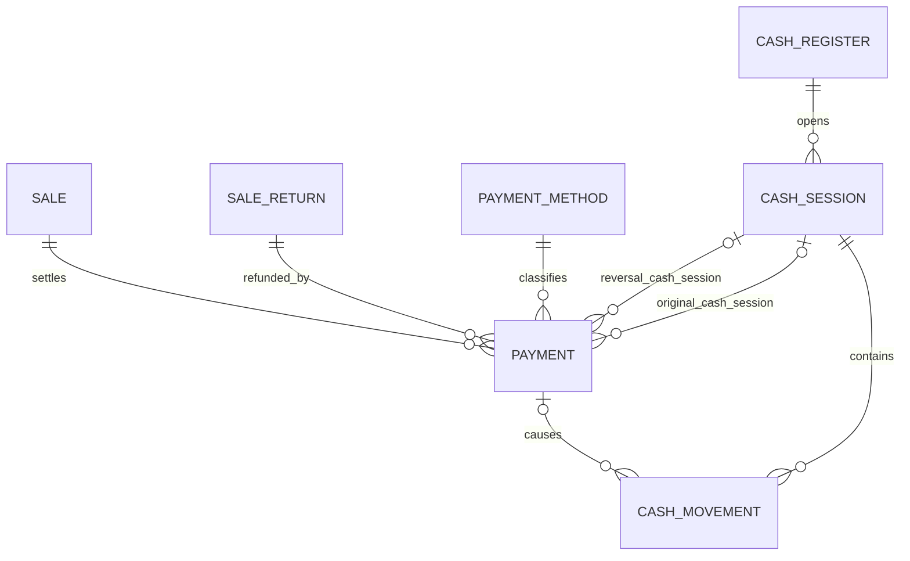
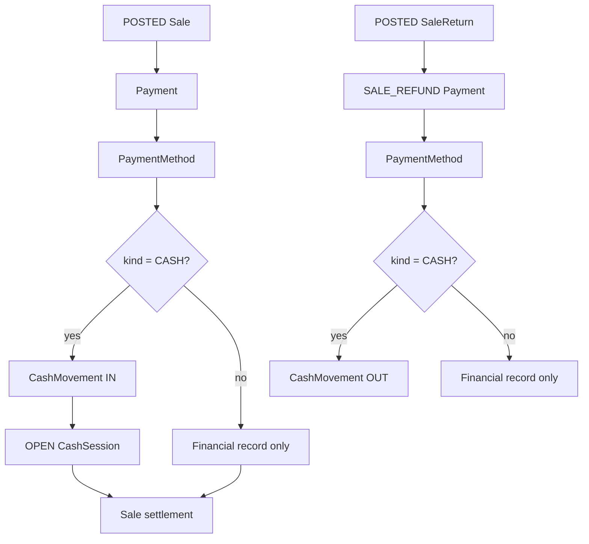
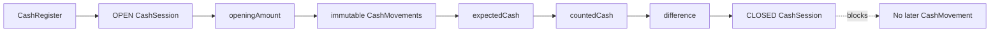

# Phase 7 Cash, Payments, and Commercial Settlement

Phase 7 adds commercial settlement to `ms-autorepuesto` without changing the
approved service boundaries. PostgreSQL owns all records below. `ms-users`
continues to own identity/RBAC, and the Gateway only forwards HTTP requests.





Payment and Refund branches have no Inventory effect. Inventory changes remain
exclusive to the pre-existing Sale POST and SaleReturn POST operations.



## Lifecycle and exact money

Payment Methods are `CASH`, `CARD`, `BANK_TRANSFER`, or `OTHER`. Cash Sessions
are `OPEN` or `CLOSED`; Payments are `POSTED` or `REVERSED`. Every monetary
column uses Prisma Decimal and PostgreSQL `NUMERIC`, and API inputs use decimal
strings with no more than two fractional digits.

A Sale may receive partial and split Payments until active `SALE_PAYMENT`
amount equals its immutable total. Non-reversed totals define settlement:
`UNPAID`, `PARTIALLY_PAID`, or `PAID`. A Payment reversal is rejected when it
would make active paid money less than active Refunds. Payment numbers use a
PostgreSQL `SERIAL` sequence.

Refund value is derived from immutable SaleItem `lineTotal`, not current Product
prices. For each item and chronologically posted Return, the allocated amount is:

```text
round(lineTotal × cumulativeReturnedAfter / soldQuantity, 2)
- round(lineTotal × cumulativeReturnedBefore / soldQuantity, 2)
```

This cumulative half-up rule ensures that returning every unit allocates the
exact original line total. Current capacity is:

```text
min(returnValue - activeRefundsForReturn,
    activeSalePayments - activeSaleRefunds)
```

## Physical Cash ledger

CashMovement amounts are always positive. Type determines direction:

| Type                    | Expected Cash effect |
| ----------------------- | -------------------- |
| `SALE_PAYMENT`          | increase             |
| `SALE_PAYMENT_REVERSAL` | decrease             |
| `SALE_REFUND`           | decrease             |
| `SALE_REFUND_REVERSAL`  | increase             |
| `MANUAL_IN`             | increase             |
| `MANUAL_OUT`            | decrease             |

Expected Cash is opening amount plus those signed effects. CASH Payment amount
is the net drawer increase; tender and change are retained separately. CARD,
BANK_TRANSFER, and OTHER operations create no CashMovement. Manual operations
require a meaningful reason. Every outflow is checked under the session lock so
expected physical Cash cannot become negative.

Closing stores exact `expectedAmount`, `countedAmount`, and their signed
`differenceAmount`. A non-zero difference requires closing notes. Closed
sessions and historical movements are immutable.

## Concurrency and lock order

A partial unique index on `CashSession(cashRegisterId) WHERE status = 'OPEN'`
is the database-level final guard against concurrent opening. Mutations run in
serializable transactions with three bounded retries.

Financial operations lock in this order:

```text
Sale → SaleReturn (Refund only) → Payment (reversal only) → CashSession
```

Opening locks CashRegister. Manual movement and close lock CashSession. This
means Payment/Refund/manual-vs-close resolves wholly before or after close; no
movement can commit into a session after its CLOSED transition. Sale locking
also serializes overpayment, over-refund, and duplicate reversal decisions.

## Database constraints and scope

The migration enforces non-negative opening/closing values, coherent OPEN/CLOSED
snapshots, positive Payment and movement amounts, tender/change equality,
Payment reference shape, coherent reversal metadata, unique business numbers,
one financial movement of each type per Payment, and restrictive foreign keys.

Payments, Refunds, reversals, and manual Cash never modify Product, Inventory,
or InventoryMovement. Supplier payments, Accounts Payable, full Accounts
Receivable, journal accounting, external processors, fiscal invoicing,
frontend, workshop, and AI are not implemented.

## Permissions

- `payment-methods.read`, `payment-methods.manage`
- `cash-registers.read`, `cash-registers.manage`
- `cash-sessions.read`, `cash-sessions.open`, `cash-sessions.close`
- `payments.read`, `payments.create`, `payments.reverse`
- `cash-movements.read`, `cash-movements.create`

## Gateway routes

The thin Gateway exposes Payment Method and Cash Register CRUD/activation under
`/api/payment-methods` and `/api/cash-registers`; opening/current-session under
`/api/cash-registers/:id`; Cash Session list/detail/summary/movement/close under
`/api/cash-sessions`; Sale Payments under `/api/sales/:id/payments`; Return
Refunds under `/api/sale-returns/:id/refunds`; and Payment detail/reversal under
`/api/payments/:id`. It forwards bearer headers, query strings, and bodies only.
