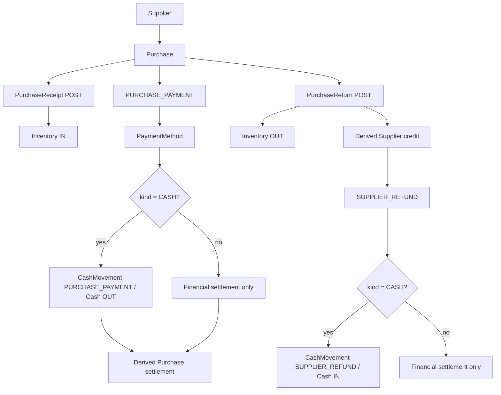
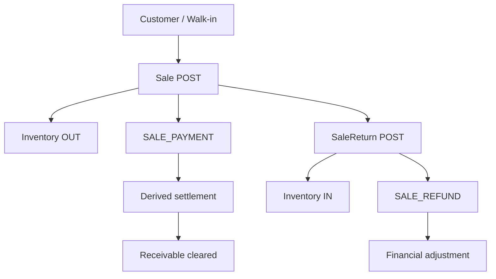

# Phase 8 Commercial Integration

Phase 8 completes BIELA's operational purchasing and sales settlement cycle in
`ms-autorepuesto`. It extends the Phase 7 `Payment` and `CashMovement` ledgers;
there is no second finance engine, Customer/Supplier balance table, accounting
journal, or Inventory side effect.

## Purchase finance and Supplier credit



A DRAFT or CANCELLED Purchase cannot receive money. CONFIRMED,
PARTIALLY_RECEIVED, and RECEIVED Purchases may be prepaid or paid partially.
Money is exact Prisma Decimal/PostgreSQL `NUMERIC`.

```text
purchaseReturnValue = cumulative allocation of immutable PurchaseItem.lineTotal
netPurchaseObligation = max(Purchase.total - posted return value, 0)
netPaidAmount = active PURCHASE_PAYMENT - active SUPPLIER_REFUND
outstandingAmount = max(netPurchaseObligation - netPaidAmount, 0)
supplierCreditAmount = max(netPaidAmount - netPurchaseObligation, 0)
```

For each PurchaseItem, a partial Return receives:

```text
round(lineTotal × cumulativeReturnedAfter / orderedQuantity, 2)
- round(lineTotal × cumulativeReturnedBefore / orderedQuantity, 2)
```

This makes all partial allocations add exactly to the immutable original line
value. Supplier Refund eligibility is the lesser of target Return value
remaining and current Supplier credit. Posting merchandise and receiving money
remain deliberately separate transactions.

## Customer finance and operational receivables



Sale outstanding remains `max(Sale.total - active SALE_PAYMENT, 0)` and Sale
Return Refund allocation retains the Phase 7 cumulative rule. Global
receivables default to documents with outstanding money and retain walk-in
Sales. Customer accounts can include settled history and summarize posted
value, active paid/refunded money, open status, and overdue counts.

## Physical Cash semantics

All ledger amounts remain positive; movement type defines direction.

| Movement type | Direction |
| --- | --- |
| `SALE_PAYMENT` | IN |
| `SALE_PAYMENT_REVERSAL` | OUT |
| `SALE_REFUND` | OUT |
| `SALE_REFUND_REVERSAL` | IN |
| `PURCHASE_PAYMENT` | OUT |
| `PURCHASE_PAYMENT_REVERSAL` | IN |
| `SUPPLIER_REFUND` | IN |
| `SUPPLIER_REFUND_REVERSAL` | OUT |
| `MANUAL_IN` / `MANUAL_OUT` | IN / OUT |

Expected physical Cash is opening amount plus those signed immutable effects.
CARD, BANK_TRANSFER, and OTHER have no physical Cash effect. Every CASH
operation requires an OPEN session on an active register; every outflow is
validated under the CashSession lock and cannot make expected Cash negative.
Closed sessions are never rewritten—CASH reversals use a current OPEN session.

## Due dates, AR/AP, and queries

`Sale.paymentDueDate` and `Purchase.paymentDueDate` are optional PostgreSQL DATE
columns. They do not drive posting, receiving, returns, or stock. The server
derives `overdue` when exact outstanding money is greater than zero and the due
date is before the current calendar date in `America/Tegucigalpa`. A paid
document is never overdue.

Operational endpoints are:

- `GET /customers/:id/account`
- `GET /suppliers/:id/account`
- `GET /commercial/receivables`
- `GET /commercial/payables`
- `GET /commercial/summary`

Account and global lists support deterministic pagination, settlement status,
due-date range, document-date range, and overdue filtering. Global lists omit
fully settled documents by default; Supplier credit remains visible. Grouped
PostgreSQL CTEs avoid per-document queries. The summary returns outstanding and
overdue operational totals plus OPEN CashSession count and expected physical
Cash. It does not report profit, COGS, inventory value, or accounting balances.

## Transactions, reversal safety, and locks

Every financial write uses the existing serializable helper with at most three
attempts for Prisma `P2034`, PostgreSQL `40001`, or `40P01`. Final lock order is:

```text
Sale or Purchase
→ SaleReturn or PurchaseReturn when applicable
→ Payment for reversal
→ CashSession for physical Cash
```

This serializes overpayment, Supplier over-refund, payment-vs-refund,
reversal-vs-refund, and financial-operation-vs-close races. A Purchase Payment
reversal is rejected when it would leave active Supplier Refunds greater than
active Purchase Payments. Reversals retain the original row and append one
compensating CashMovement when the original operation was CASH.

## Database and RBAC

The two additive Phase 8 migrations first extend PostgreSQL enums, then add
nullable due dates, nullable Purchase/Return references, reference-shape checks,
foreign keys, and real query-path indexes. PostgreSQL requires the enum values
to commit before a later constraint references them.

Phase 8 adds these permissions:

- `purchases.pay`
- `commercial-receivables.read`
- `commercial-payables.read`
- `commercial-summary.read`

Shared `payments.read`, `payments.create`, and `payments.reverse` remain valid.
ADMIN receives all permissions idempotently. Actor IDs come from the validated
bearer context; `ms-autorepuesto` never reads MongoDB.

## Explicit limitations

General accounting, journal entries, inventory valuation/COGS, fiscal
invoicing, external payment/banking integrations, frontend, workshop, and AI
are deferred. Phase 8 provides operational document settlement views, not an
accounting ledger or financial statements.
